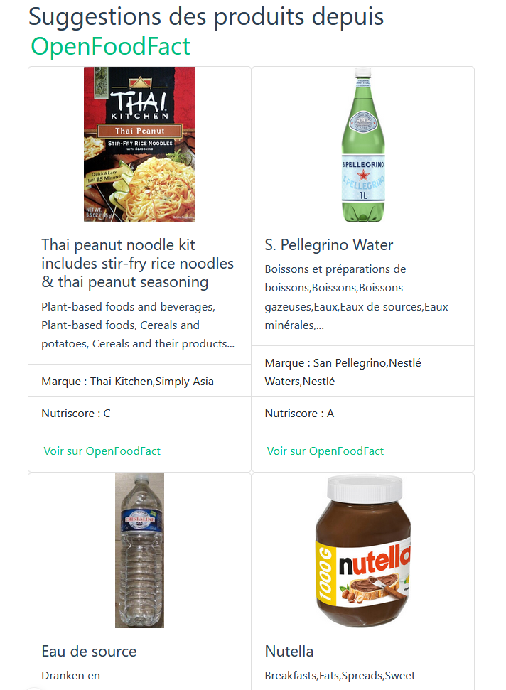

# Exercice 7 : liste d'achat avec les hooks du cycle de vie

1. Reprenez l'exercice 6.
2. Greffez-vous au ***hook onMounted*** pour récupérer et afficher quelques informations fournies par [l'API OpenFoodFacts à partir d'un code produit](https://world.openfoodfacts.org/api/v3/product/737628064502.json)

## Aide utilisation de l'API d'OpenFoodFact

- Pour faire des appels vers un serveur distant, vous pouvez utiliser la fonction native [fetch](https://developer.mozilla.org/fr/docs/Web/API/Fetch_API/Using_Fetch
) de VanillaJS (JavaScript native)
- [Exemple d'URL https://world.openfoodfacts.org/api/v3/product/***737628064502***.json](https://world.openfoodfacts.org/api/v3/product/737628064502.json), avec ***737628064502*** identifiant unique d'un produit. Il vous suffit de remplacer ***737628064502*** par l'indentifiant de votre choix existant dans la base de données d'OpenFoodFact.

## Quelques identifiants de produit

- 3017620425035
- 3274080005003
- 5449000214911
- 8002270014901
- 7613034626844
- 737628064502
- 3228857000906
- 87157215
- 3124480191182
- 80052760
- 8715035110106

```js
const codes = [
  '3017620425035',
  '3274080005003',
  '5449000214911',
  '8002270014901',
  '7613034626844',
  '737628064502',
  '3228857000906',
  '87157215',
  '3124480191182',
  '80052760',
  '8715035110106'
]
```

## Quelques propriétés retournées en français ainsi que les clés associées entre les parenthèses

Attention les propriétés ci-dessous entre parenthèses sont accessibles depuis l'objet ***product*** de la réponse du serveur après transformation en JSON
- Code (*code*)
- Marque (*brands*)
- Catégories (*categories*)
- Créateur (*creator*)
- Date de création (*created_at*)
- Lien vers une photo du produit (*image_url*)
- Ingrédients (*ingredients*)
- Matériel pour le packaging (*packaging_materials*)
- Le score nutriscore (*nutriscore_grade*)
- Nom du produit (*product_name*)

```js
fetch(`https://fr.openfoodfacts.org/api/v3/produit/${codes[0]}`)
  .then(res => res.json())
  .then(res => {
    const { 
      code,
      brands,
      categories,
      creator,
      created_at,
      image_url,
      ingredients,
      packaging_materials,
      nutriscore_grade,
      product_name,
      sources
    } = res.product
  })
  .catch((error) => console.error('error', error))
```
## Illustration non-contractuelle

